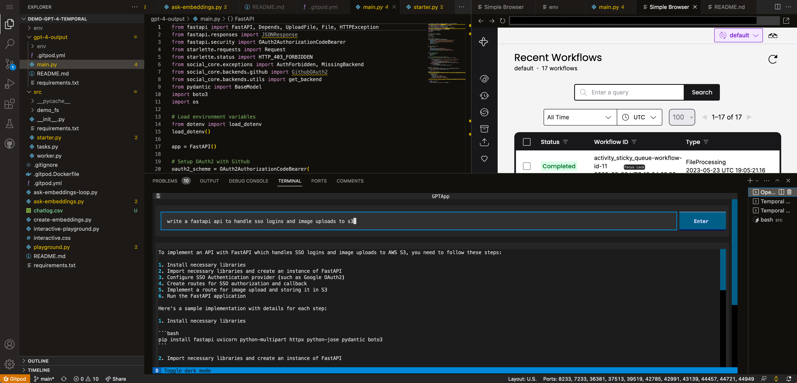

# Gitpod and Temporal Demo w/ GPT-4



A demo using Gitpod and Temporal to demonstrate workflows

Uses GPT-4 to retrieve docs and do an embedding for development based upon [this link](https://github.com/openai/openai-cookbook/blob/main/examples/vector_databases/pinecone/GPT4_Retrieval_Augmentation.ipynb).

Can then be used to add your data / context to your prompt, adding your knowledge to what GPT-4 has as context.

[](https://gitpod.io/#https://github.com/burningion/demo-gitpod-temporal)

# Running the Retrieval Augmentation  workflow

This example workflow scrapes a set of webpages from the Gitpod website, looking to steer GPT-4 with augmented data as to how to build a Gitpodified project.

It uses Pinecone as our Vector database, so you'll need to create a database with `1536` dimensions in order to run GPT-4 embeddings.

The free tier of Pinecone works well enough to run this example.

To run the Temporal workers you'll need to run the following:

```bash
$ cd src
$ python3 worker.py
```

In another terminal, you can create and send the jobs to the workers with the starter:

```bash
$ cd src
$ python3 starter.py
```

Check the output by going to port `8233` in Gitpod, you'll see your workflows executing.

If you want to add your own URLs, look at the list of URLs at the beginning of the `starter.py` file.